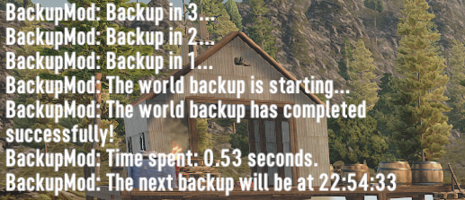

# BackupMod


A 7 days to die modlet which makes it possible to automatically backup and restore your game saves

# Settings

You can configure the modlet by modifying the 'settings.json' file.  
If you changed the configuration when you were in game, you should re-enter to your world to apply changed settings.

```
{
  "General": {
    // Backups limit
    // Default: 10
    "BackupsLimit": 10,
    
    // Custom backups folder path
    // IMPORTANT: You must escape all '\' characters or use '/'
    // Example: "C:\\7DaysToDie\\Backups"
    // Default: ""
    "CustomBackupsFolder": ""
  },
  
  "AutoBackup": {
    // Is automatic backup enabled
    // Default: true
    "Enabled": true,
    
    // Auto backup delay (seconds)
    // Default: 1200 (20 minutes)
    "Delay": 1200
  },
  
  "Archive": {
    // Keep the last backup of the day
    "Enabled": false,

    // Backups limit
    // Default: 10
    "BackupsLimit": 10,
    
    // Custom archive folder path.
    // IMPORTANT: You must escape all '\' characters or use '/'
    // Example: "C:\\7DaysToDie\\Archive".
    // Default: ""
    "CustomArchiveFolder": ""
  },
  
  "Events": {
    // Backup when entering the world
    // Default: true
    "BackupOnWorldLoaded": true
  },
  
  "Utilities": {
    // Chat notifications
    // Default: true
    "ChatNotificationsEnabled": true
  }
}
```
By default, your backups for each save will be saved in the '**%AppData%/Roaming/7DaysToDie/Backups/%WorldName%/%SaveName%**' folder  
and your archived backups for each save will be saved in the '**%AppData%/Roaming/7DaysToDie/Archive/%WorldName%/%SaveName%**' folder.

# Commands
You can use the '**backup**' command or its shortened version - the '**bp**' command

'**backup**' - perform a forceful backup  
'**backup info**' - show the current configuration of the mod  
'**backup list**' - show all available backups  
'**backup restore**' - restore a save from a backup  
'**backup delete**' - delete a backup

# Installation
1. Extract the downloaded .zip archive
2. Move the extracted 'BackupMod' folder to your 'Mods' folder

# Compatibility
Required game version: Alpha 20

# EAC Compatibility
Server only. To load in single-player mode, you must disable EAC.

# Links
[Official] [community.7daystodie.com](https://community.7daystodie.com/topic/28451-backup-mod/) 
[Official] [Nexus Mods](https://www.nexusmods.com/7daystodie/mods/2210) 
[Unofficial] [7daystodiemods.com](https://7daystodiemods.com/backup-mod/)

# Support
[](https://www.buymeacoffee.com/ntaklive)
